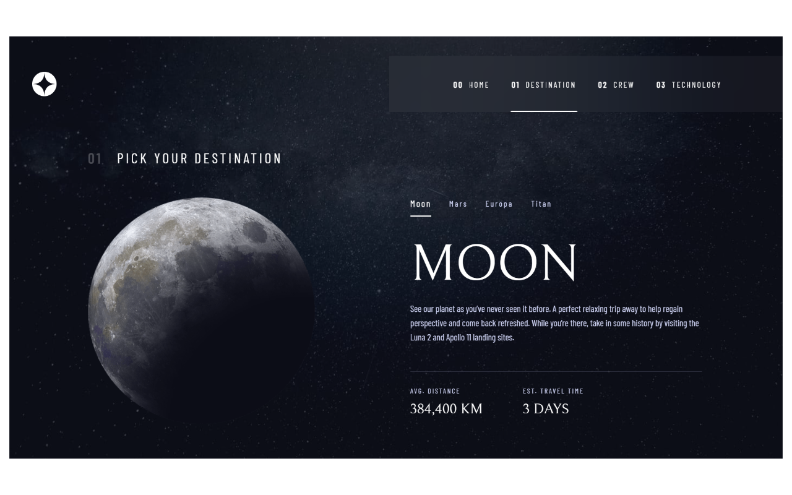
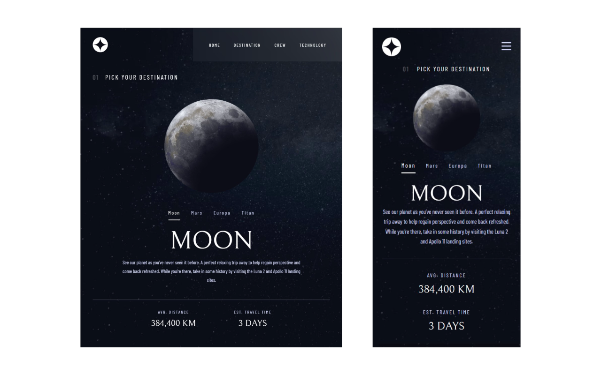

# Frontend Mentor - Space tourism website solution

This is a solution to the [Space tourism website challenge on Frontend Mentor](https://www.frontendmentor.io/challenges/space-tourism-multipage-website-gRWj1URZ3).

## Table of contents

- [Overview](#overview)
  - [The challenge](#the-challenge)
  - [Screenshots](#screenshots)
  - [Links](#links)
- [My process](#my-process)
  - [Built with](#built-with)
  - [What I learned](#what-i-learned)
- [Author](#author)

## Overview

### The challenge

Users should be able to:

- View the optimal layout for each of the website's pages depending on their device's screen size
- See hover states for all interactive elements on the page
- View each page and be able to toggle between the tabs to see new information

### Screenshots

#### Desktop

#### Tablet / Mobile

### Links

- Solution URL (Github): [https://github.com/flying-turtle001/space-tourism-website](https://github.com/flying-turtle001/space-tourism-website)
- Live Site URL: [https://stoic-brattain-cee419.netlify.app/](https://stoic-brattain-cee419.netlify.app/)

## My process

### Built with

- Mobile-first workflow
- [React](https://reactjs.org/) - JS library
- [Gatsby](https://www.gatsbyjs.com/) - React framework

### `npm run develop`

Runs the app in the development mode.\
Open [http://localhost:8000](http://localhost:8000) to view it in your browser.

### What I learned

I used this project to further develop my skills and knowledge in React.

Since I have been interested in the React framework [Gatsby](https://www.gatsbyjs.com/) for a long time, I use this project to get started with Gatsby. It was important for me to use as many features of Gatsby as possible.

Since this project was a website with multiple pages, I was able to gain experience with routing. In addition, I also use Gatsby plugins, such as the plugin [gatsby-plugin-web-font-loader](https://www.gatsbyjs.com/plugins/gatsby-plugin-web-font-loader/) to integrate Google Fonts into the website.

For the styling of the website I decided to use CSS Modules. This allowed me to give each component its own style without running the risk of influencing other components with the CSS. This approach was also a good exercise to improve my CSS skills and also to apply modern CSS layout features like Flexbox.

I also put a lot of emphasis on component-based development. Therefore I tried to split the website into as many single components as possible. For example, I developed a custom and reusable "Tabs" component with functions to jump back and forth between individual tabs.

To practice working with third party packages, I decided to use [Swiper](https://swiperjs.com/) for the sliders in the project.

All in all, the main thing I learned from this project was how to implement professional screen designs and design systems using React and Gatsby. I also learned a lot about Gatsby and in general about React and its ecosystem.

## Author

- Website - [https://sitesandnetwork.com/](https://sitesandnetwork.com/)
- LinkedIn - [https://www.linkedin.com/in/justin-esposito-947108200/](https://www.linkedin.com/in/justin-esposito-947108200/)
